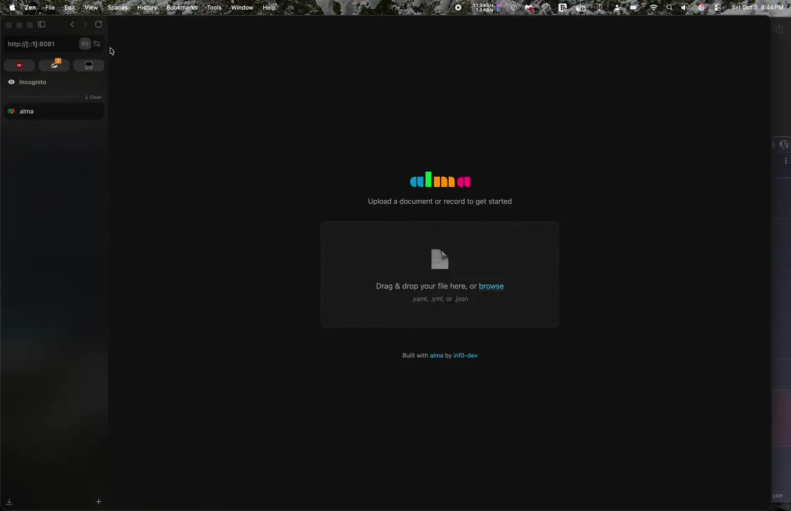
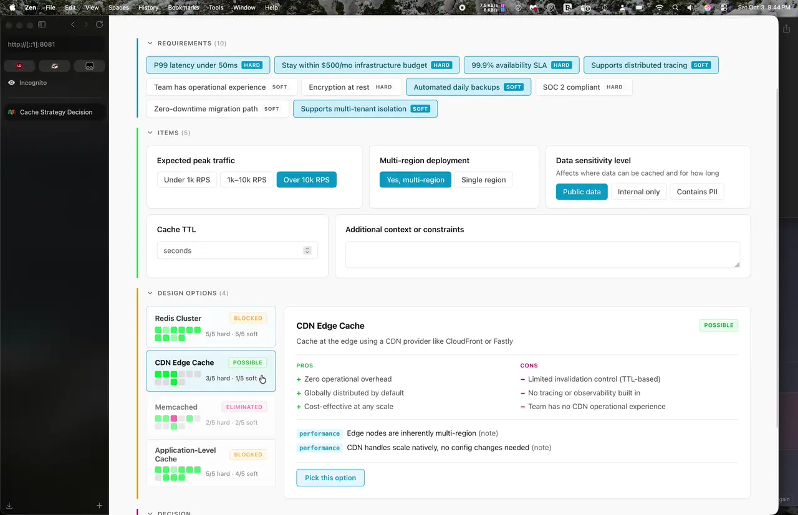
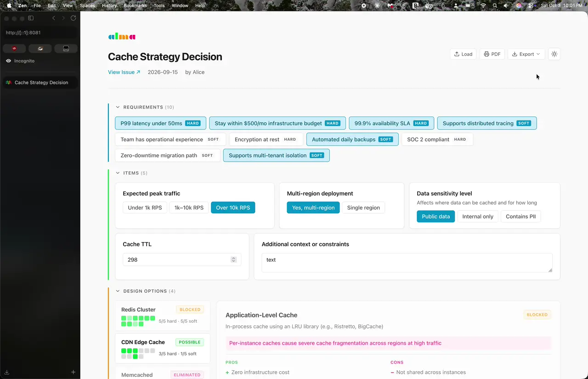

<p align="center">
  
</p>

# alma

**AL**ignment **MA**trix. A declarative tool for structured design decisions.

Define requirements, items, and design options in a YAML/JSON file. `alma` evaluates which options are viable based on constraints and renders an interactive UI for alignment meetings.

<p align="center">
  
</p>

<p align="center">
  
</p>

<p align="center">
  
</p>

## Quick Start

```bash
# build the binary
just build

# start the server (opens upload UI at localhost:8080)
just serve

# or start with a file pre-loaded - if running after `just build`, `alma` is located in `./_output/alma`
alma serve -p path/to/document.yaml
```

Open `http://localhost:8080`, drag in a document or record file, and start aligning.

> Tip: A demo file is included at `internal/pkg/renderer/testdata/demo.yaml` for reference.

## CLI

```
alma validate -p <file>           Validate a document or record
alma render -p <file> [-o f]      Render to self-contained HTML (stdout or file)
alma export -p <file>             Export a record as markdown, JSON, or YAML
alma serve [-p <file>] [-a addr]  Start the web server
```

## Development

```bash
just go_test_unit          # unit tests
just go_test_integration   # integration tests
just test                  # all tests + merged coverage
just update_golden         # regenerate golden files
just demo                  # render demo and open in browser
just a11y                  # run pa11y accessibility checks
just lint                  # golangci-lint
just fmt                   # go fmt
```

## How It Works

1. **Document**: defines requirements (hard/soft), items (choices, text, numbers), and design options with their constraints
2. **Engine**: evaluates which options are possible, blocked, or eliminated based on current state
3. **Renderer**: produces a self-contained HTML page with interactive controls
4. **Server**: serves the UI, syncs state on every interaction, supports load/export
